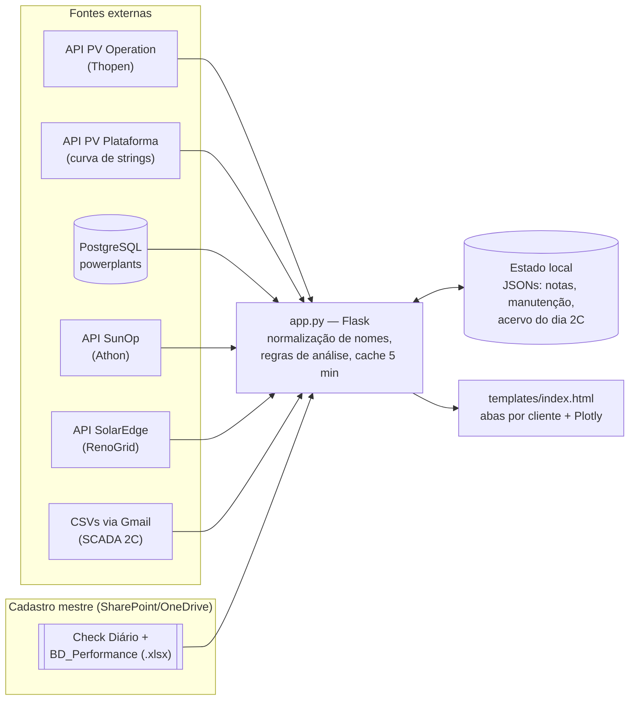

# ☀️ Dashboard O&M Solar — Strings · ETM · Geração · Trackers


Dashboard web de **Operação & Manutenção (O&M) de usinas fotovoltaicas** que consolida,
numa única tela, dados de **6 sistemas de monitoramento diferentes** (um por
cliente/integrador): strings ativas × esperadas, pré-análise de estações meteorológicas
(ETM), geração diária, performance ratio por inversor e status de trackers.

> 📚 **Documentação completa em [`docs/`](docs/README.md)** — comece pela
> [Arquitetura & Operação](docs/arquitetura.md).

---

## O problema que ele resolve

Cada cliente/integrador usa uma plataforma de monitoramento própria, com nomes de usinas e
inversores diferentes entre si. O analista de O&M precisava abrir 6 sistemas, todos os dias,
para responder a uma única pergunta: *"alguma string, sensor ou tracker parou?"*.

Este dashboard unifica tudo: autentica em cada fonte, normaliza os nomes via cadastro
mestre (planilhas Excel no SharePoint), aplica as regras de análise e apresenta o
resultado em abas por cliente — com drill-down até a string individual.

## Fontes de dados

| Fonte | Cliente | UFVs | Strings | ETM | Geração | Trackers | Integração |
|---|---|---:|:-:|:-:|:-:|:-:|---|
| API PV Operation | Thopen | ~142 | ✅ | ✅ | PR/inversor | — | REST + token |
| API PV Plataforma | Thopen | — | ✅ curva/dia | — | — | — | REST + JWT de sessão |
| PostgreSQL `powerplants` | Thopen | ~34 | ✅ | ✅ | ✅ período | ✅ 788 un. | psycopg2 (warehouse dbt) |
| API SunOp | Athon | 10 | ✅ | ✅ +POA-RI | — | ✅ + curva | REST + JWT |
| API SolarEdge (interna) | RenoGrid | 7 | ✅ | — | — | — | Cognito SRP + cookie |
| CSVs por e-mail (SCADA) | 2C | 4 | ✅ | ✅ | — | ✅ | Gmail OAuth + acumulador |

## Arquitetura



- **Backend:** Flask monolítico ([app.py](app.py)), cache em memória de 5 min por endpoint.
- **Frontend:** página única ([templates/index.html](templates/index.html)), HTML+CSS+JS
  sem build, gráficos com Plotly via CDN.
- **Persistência:** arquivos JSON locais (estado de UI e acumuladores) + planilhas Excel
  (cadastro) — sem banco próprio.

## Como rodar

### Pré-requisitos

- Windows + Python 3.x
- Acesso às planilhas no OneDrive/SharePoint (cadastro mestre)
- Credenciais das fontes (ver abaixo)

### Configuração

```powershell
# 1. Instalar dependências
pip install -r requirements.txt

# 2. Configurar credenciais
copy .env.example .env
#    → preencher o .env com as credenciais reais (nunca commitar!)
```

### Iniciar

```powershell
# Opção 1 — duplo clique em:
Iniciar Dashboard.bat

# Opção 2 — manual:
python app.py
```

Abra **http://localhost:5050**. O botão **↻ Atualizar** zera os caches e refaz todas as fontes.

## Estrutura do repositório

```
pv_dashboard/
├── app.py                    # backend Flask (todas as fontes + endpoints)
├── templates/index.html      # frontend completo (single page)
├── static/                   # logos
├── docs/                     # 📚 documentação técnica (arquitetura, regras, APIs)
├── tracker_watch.py          # rastreador persistente de anomalias de trackers (CLI)
├── coletar_geracao_hoje.py   # coleta standalone: geração + irradiação → Excel
├── collect_energy.py         # coleta standalone: energia por inversor
├── .env.example              # modelo de configuração (credenciais via .env)
├── Iniciar Dashboard.bat     # atalho de inicialização (instala deps + sobe servidor)
├── Procfile / railway.toml   # deploy experimental (gunicorn)
└── requirements.txt
```

Arquivos de **estado/runtime** (`*_accum.json`, `ufv_state.json`, tokens `.txt`, planilhas
`.xlsx`) ficam na pasta em tempo de execução e **não são versionados** (ver [.gitignore](.gitignore)).

## Segurança

- Nenhuma credencial no código ou no repositório: tudo via `.env` (gitignored), com
  modelo documentado em [`.env.example`](.env.example).
- Tokens de sessão (SunOp, PV Plataforma) expiram em ~7 dias e exigem renovação manual —
  o procedimento está em [docs/arquitetura.md](docs/arquitetura.md) (§ Como rodar/operar).
- Pendências conhecidas estão listadas em
  [docs/arquitetura.md → Pontos fracos/riscos](docs/arquitetura.md).

## Documentação

| Doc | Conteúdo |
|---|---|
| [docs/arquitetura.md](docs/arquitetura.md) | **Handover completo**: fontes, auth, cadastro mestre, gotchas, riscos, operação |
| [docs/regras-de-negocio.md](docs/regras-de-negocio.md) | Regras de análise (string ativa, ETM, trackers) e estado compartilhado |
| [docs/api-pv-operation.md](docs/api-pv-operation.md) | Referência da API PV Operation |
| [docs/coleta-sunop.md](docs/coleta-sunop.md) | Referência da API SunOp (histórico via `analog_values`) |

---

**Projeto interno Grid Co.** — desenvolvido para o time de O&M solar.
